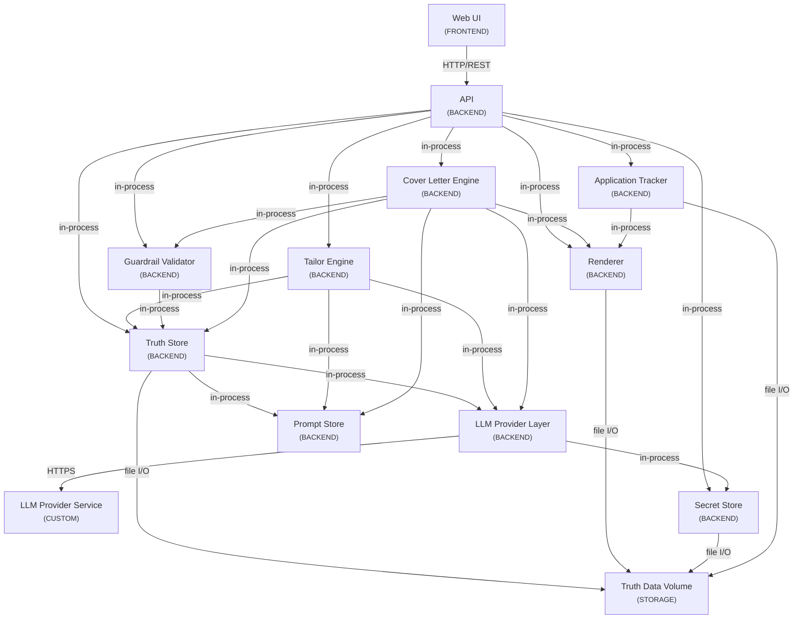

# Network Topology & Communication Map

This file visually and structurally defines how components are authorized to interact. AI agents must verify and respect these communication boundaries during implementation.

