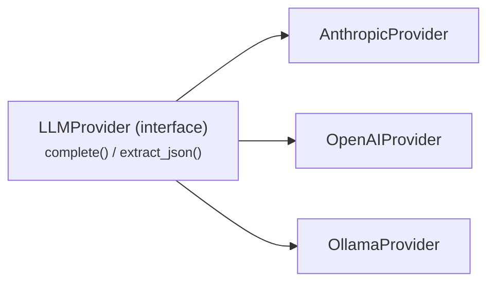

# Component Specification: LLM Provider Layer
- **Identifier**: `llm-provider-layer`
- **Component Type**: BACKEND

> This file is generated dynamically from the spatial architecture canvas. Do not edit directly—use the visual workspaces instead.

## Intent & Scope Description (TEXT)

Thin LLMProvider abstraction (providers/) with three implementations — anthropic | openai | ollama — selected by the LLM_PROVIDER env var. Interface: complete(system, messages) → str and extract_json(system, messages, schema) → dict. Adding a provider later = one new file; no truthfulness logic depends on which provider is active.

---

## Tech Stack Profiles (TECHSTACK)

Supported tools, frameworks, and packages:
- **Python**
- **anthropic SDK**
- **openai SDK**
- **Ollama**

---

## LLMProvider abstraction (DIAGRAM)

---
