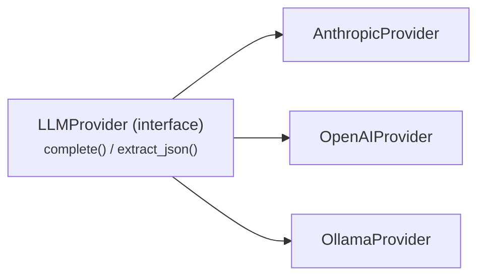

<!-- generated:start cap:overview-intro -->
> These architecture docs are **not verified at the current commit** (no full drift sweep has run yet). Treat them as a snapshot and verify against source before relying on them.

# Architecture Overview

13 component(s) declared on the architecture canvas. Topology: [system-map.md](system-map.md).
<!-- generated:end cap:overview-intro -->

<!-- generated:start comp:web-ui -->
> **Not verified at the current commit** — source has changed since the last full sweep, or none has run. Treat this section as a snapshot and verify against source before relying on it.
## Web UI (`web-ui`, FRONTEND)

React single-page wizard (web/) that walks the user through Upload LinkedIn PDF → Review extracted truth → Paste job posting (with optional Fetch-from-URL) → Confirm inferences → Download PDF/DOCX. Built by Vite into a static bundle that the API serves. No auth, single-user per deployment.

**Tech:** React, Vite, TypeScript, MUI (@mui/material), Emotion (@emotion/react)
<!-- generated:end comp:web-ui -->

<!-- generated:start comp:api -->
> **Not verified at the current commit** — source has changed since the last full sweep, or none has run. Treat this section as a snapshot and verify against source before relying on it.
## API (`api`, BACKEND)

FastAPI backend (api/) that serves the static React bundle and exposes the wizard REST routes. Orchestrates the pipeline: PDF upload → truth extraction → job tailoring → guardrail validation → render/download. Configured entirely from env / .env at container start (no secrets entered in the UI).

**Tech:** Python, FastAPI, Uvicorn
<!-- generated:end comp:api -->

<!-- generated:start comp:truth-store -->
> **Not verified at the current commit** — source has changed since the last full sweep, or none has run. Treat this section as a snapshot and verify against source before relying on it.
## Truth Store (`truth-store`, BACKEND)

Owns truth.yaml, the single origin of all facts (truth/). Extracts text from the uploaded LinkedIn PDF via pypdf, uses a provider to build a structured truth file (every role/company/date/bullet/skill tagged source:linkedin-pdf with a stable id), and builds/validates/persists it. User-confirmed inferences are written back tagged source:user-confirmed.

**Tech:** Python, pypdf, PyYAML
<!-- generated:end comp:truth-store -->

<!-- generated:start comp:tailor-engine -->
> **Not verified at the current commit** — source has changed since the last full sweep, or none has run. Treat this section as a snapshot and verify against source before relying on it.
## Tailor Engine (`tailor-engine`, BACKEND)

Tailors a CV to a specific posting (tailor/). Extracts the posting's keywords/requirements via a provider, then selects, reorders, and rephrases ONLY entries referenced by id from truth.yaml. Detects any claim the LLM wants to add that is not already in the truth file and surfaces it as an approval checklist (confirm-inferences step); nothing unapproved reaches the CV.

**Tech:** Python
<!-- generated:end comp:tailor-engine -->

<!-- generated:start comp:guardrail-validator -->
> **Not verified at the current commit** — source has changed since the last full sweep, or none has run. Treat this section as a snapshot and verify against source before relying on it.
## Guardrail Validator (`guardrail-validator`, BACKEND)

The core truthfulness guardrail (guardrail/): a pure, deterministic, scoped token-diff of a draft against truth — no LLM. validate(scopes, global_values) returns ok plus BOTH a flat unverifiable[] token list (back-compat) and structured blocked_claims grouping untraceable tokens under the specific source text (bullet) and scope id they came from, so callers can present whole-claim approve/deny. A token is verifiable if it is a stopword or appears (post-tokenization) in its own scope's allowed set (or global skills). Render-scoped approvals are passed in by merging an approved claim's text into that scope's allowed set for a single render — the guardrail itself never mutates truth.

**Tech:** Python
<!-- generated:end comp:guardrail-validator -->

<!-- generated:start comp:renderer -->
> **Not verified at the current commit** — source has changed since the last full sweep, or none has run. Treat this section as a snapshot and verify against source before relying on it.
## Renderer (`renderer`, BACKEND)

Renders the approved CV from one Jinja-templated ATS-safe HTML source (render/): PDF via WeasyPrint (pure-Python, single column, selectable text) and DOCX via pandoc. Runs an ATS linter before download that warns on multi-column layouts, tables, text-in-images, non-standard headings, missing contact block, and posting keywords absent from the CV. No LLM dependency.

**Tech:** Python, Jinja2, WeasyPrint, pandoc
<!-- generated:end comp:renderer -->

<!-- generated:start comp:llm-provider-layer -->
> **Not verified at the current commit** — source has changed since the last full sweep, or none has run. Treat this section as a snapshot and verify against source before relying on it.
## LLM Provider Layer (`llm-provider-layer`, BACKEND)

Thin LLMProvider abstraction (providers/) with three implementations — anthropic | openai | ollama — selected by the LLM_PROVIDER env var. Interface: complete(system, messages) → str and extract_json(system, messages, schema) → dict. Adding a provider later = one new file; no truthfulness logic depends on which provider is active.

**Tech:** Python, anthropic SDK, openai SDK, Ollama

**Internal structure:**

<!-- generated:end comp:llm-provider-layer -->

<!-- generated:start comp:truth-data-volume -->
> **Not verified at the current commit** — source has changed since the last full sweep, or none has run. Treat this section as a snapshot and verify against source before relying on it.
## Truth Data Volume (`truth-data-volume`, STORAGE)

The single mounted volume (./data) that persists truth.yaml and generated CVs (PDF/DOCX) across container restarts. There is no database — this flat, id-referenced file store is the entire persistence layer.

**Tech:** Docker volume, YAML files
<!-- generated:end comp:truth-data-volume -->

<!-- generated:start comp:llm-provider-service -->
> **Not verified at the current commit** — source has changed since the last full sweep, or none has run. Treat this section as a snapshot and verify against source before relying on it.
## LLM Provider Service (`llm-provider-service`, CUSTOM)

External LLM inference reached by the provider layer: Anthropic or OpenAI cloud APIs (bring-your-own API key), or a local Ollama container for fully offline use (optional compose profile). Used for PDF→truth extraction, posting keyword extraction, and id-referenced tailoring/rephrasing.

**Tech:** Anthropic API, OpenAI API, Ollama
<!-- generated:end comp:llm-provider-service -->

<!-- generated:start comp:cover-letter-engine -->
> **Not verified at the current commit** — source has changed since the last full sweep, or none has run. Treat this section as a snapshot and verify against source before relying on it.
## Cover Letter Engine (`cover-letter-engine`, BACKEND)

Guardrailed cover-letter generation (coverletter/). build_letter() asks the LLM (via the provider layer) for a cover letter as tagged paragraphs, each declaring the factual claims it makes. Every claim is validated by the Guardrail Validator against the Truth Store; if any claim is unverifiable the letter is BLOCKED (returns {blocked: true, unverifiable, text: ""}). Otherwise the paragraph text is joined and handed to the Renderer for HTML/PDF/DOCX output. Serves /api/cover-letter together with render/.

**Tech:** Python
<!-- generated:end comp:cover-letter-engine -->

<!-- generated:start comp:prompt-store -->
> **Not verified at the current commit** — source has changed since the last full sweep, or none has run. Treat this section as a snapshot and verify against source before relying on it.
## Prompt Store (`prompt-store`, BACKEND)

The single home for every LLM prompt in TruthCV (prompts/). A shared, fact-free prompt-template library: style-only fragments (CV_STYLE, LETTER_STYLE), the truth-extraction prompt, tailoring prompts (keyword extraction, missing-qualification inference, CV selection) with truth-block renderers, and cover-letter prompts. A pure leaf that depends downward only on truth.model; imported by truth-store, tailor-engine and cover-letter-engine.

**Tech:** Python
<!-- generated:end comp:prompt-store -->

<!-- generated:start comp:secret-store -->
> **Not verified at the current commit** — source has changed since the last full sweep, or none has run. Treat this section as a snapshot and verify against source before relying on it.
## Secret Store (`secret-store`, BACKEND)

Neutral encrypted credential/secrets vault (secretstore/), extracted from the API to break the api↔providers import cycle. Resolves LLM credentials — reading data/secrets.enc (Fernet, gated on ENCRYPTION_KEY) and falling back to environment variables — and persists them via atomic tmp-rename. A leaf that uses truth.store.data_dir only for the data path. Depended on downward by both the API and the LLM Provider Layer.

**Tech:** Python, cryptography (Fernet)
<!-- generated:end comp:secret-store -->

<!-- generated:start comp:application-tracker -->
> **Not verified at the current commit** — source has changed since the last full sweep, or none has run. Treat this section as a snapshot and verify against source before relying on it.
## Application Tracker (`application-tracker`, BACKEND)

Owns the user's job-application records (applications/) persisted as applications.json on the Truth Data Volume. Each Application tracks a submission (Company, Website, Application URL, Submitted, Submission Type, Reached Out, To Who, Response Received, Method) and OWNS its generated documents: an editable CV and cover letter saved per-application (so old outputs are retained and traceable to the application they went out with). Applications may exist WITHOUT a job posting (General/portal submissions). CRUD helpers use atomic writes mirroring truth/store.py; re-renders edited document content via the Renderer.

**Tech:** Python, PyYAML/JSON
<!-- generated:end comp:application-tracker -->
