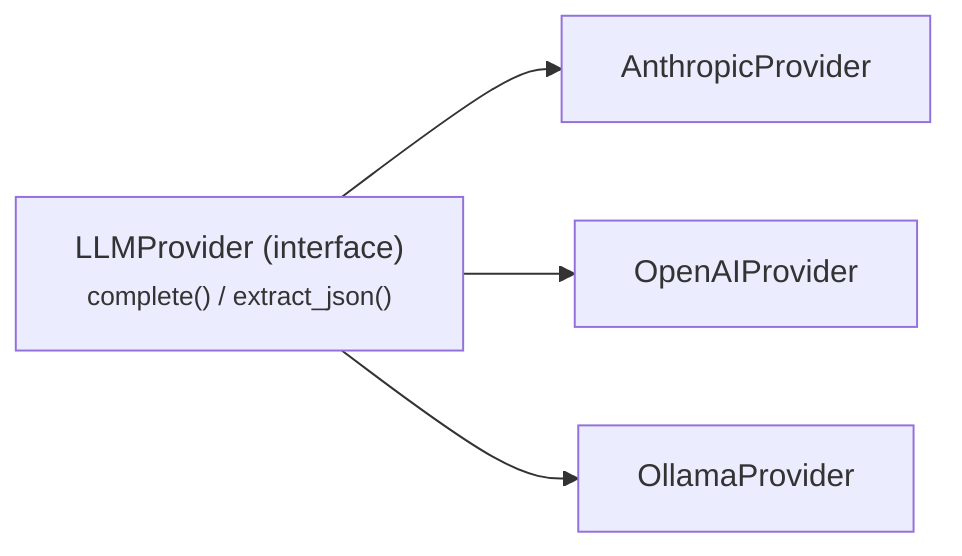

<!-- generated:start cap:overview-intro -->
# Architecture Overview

25 component(s) declared on the architecture canvas. Topology: [system-map.md](system-map.md).
<!-- generated:end cap:overview-intro -->

<!-- generated:start comp:web-ui -->
## Web UI (`web-ui`, FRONTEND)

React single-page app (web/) with client-side routing (react-router). Lands on /analytics; the manual CV flow is its own /cv route (Upload LinkedIn PDF → Review extracted truth → Paste job posting (with optional Fetch-from-URL) → Confirm inferences → Download PDF/DOCX), and Applications, Agents, Screenings and Approvals each have their own URL, so a refresh keeps the user where they were. Built by Vite into a static bundle that the API serves (its catch-all returns index.html for deep links). No auth, single-user per deployment.

**Tech:** React, Vite, TypeScript, MUI (@mui/material), Emotion (@emotion/react), react-router-dom v6
<!-- generated:end comp:web-ui -->

<!-- generated:start comp:api -->
## API (`api`, BACKEND)

FastAPI backend (api/) that serves the static React bundle and exposes the wizard REST routes. Orchestrates the pipeline: PDF upload → truth extraction → job tailoring → guardrail validation → render/download. Configured entirely from env / .env at container start (no secrets entered in the UI).

**Tech:** Python, FastAPI, Uvicorn
<!-- generated:end comp:api -->

<!-- generated:start comp:truth-store -->
## Truth Store (`truth-store`, BACKEND)

Owns truth.yaml, the single origin of all facts (truth/). Extracts text from an uploaded CV in any supported format — PDF (pypdf), DOCX (python-docx), TXT or Markdown — uses a provider to build a structured truth file (every role/company/date/bullet/skill tagged source:uploaded-cv with a stable id), and builds/validates/persists it. Legacy entries tagged linkedin-pdf remain valid. User-confirmed inferences are tagged user-confirmed.

**Tech:** Python, pypdf, PyYAML, python-docx
<!-- generated:end comp:truth-store -->

<!-- generated:start comp:tailor-engine -->
## Tailor Engine (`tailor-engine`, BACKEND)

Tailors a CV to a specific posting (tailor/). Extracts the posting's keywords/requirements via a provider, then selects, reorders, and rephrases ONLY entries referenced by id from truth.yaml. Detects any claim the LLM wants to add that is not already in the truth file and surfaces it as an approval checklist (confirm-inferences step); nothing unapproved reaches the CV.

**Tech:** Python
<!-- generated:end comp:tailor-engine -->

<!-- generated:start comp:guardrail-validator -->
## Guardrail Validator (`guardrail-validator`, BACKEND)

The core truthfulness guardrail (guardrail/): a pure, deterministic, scoped token-diff of a draft against truth — no LLM. validate(scopes, global_values) returns ok plus BOTH a flat unverifiable[] token list (back-compat) and structured blocked_claims grouping untraceable tokens under the specific source text (bullet) and scope id they came from, so callers can present whole-claim approve/deny. A token is verifiable if it is a stopword or appears (post-tokenization) in its own scope's allowed set (or global skills). Render-scoped approvals are passed in by merging an approved claim's text into that scope's allowed set for a single render — the guardrail itself never mutates truth.

**Tech:** Python
<!-- generated:end comp:guardrail-validator -->

<!-- generated:start comp:renderer -->
## Renderer (`renderer`, BACKEND)

Renders the approved CV from one Jinja-templated ATS-safe HTML source (render/): PDF via WeasyPrint (pure-Python, single column, selectable text) and DOCX via pandoc. Runs an ATS linter before download that warns on multi-column layouts, tables, text-in-images, non-standard headings, missing contact block, and posting keywords absent from the CV. No LLM dependency.

**Tech:** Python, Jinja2, WeasyPrint, pandoc
<!-- generated:end comp:renderer -->

<!-- generated:start comp:llm-provider-layer -->
## LLM Provider Layer (`llm-provider-layer`, BACKEND)

Thin LLMProvider abstraction (providers/) with three implementations — anthropic | openai | ollama — selected by the LLM_PROVIDER env var. Interface: complete(system, messages) → str and extract_json(system, messages, schema) → dict. Adding a provider later = one new file; no truthfulness logic depends on which provider is active.

**Tech:** Python, anthropic SDK, openai SDK, Ollama

**Internal structure:**

```mermaid
flowchart LR
    llmprovider-interface["LLMProvider (interface)<br/><small>complete() / extract_json()</small>"]
    anthropicprovider["AnthropicProvider"]
    openaiprovider["OpenAIProvider"]
    ollamaprovider["OllamaProvider"]
    llmprovider-interface --> anthropicprovider
    llmprovider-interface --> openaiprovider
    llmprovider-interface --> ollamaprovider
```
<!-- generated:end comp:llm-provider-layer -->

<!-- generated:start comp:truth-data-volume -->
## Truth Data Volume (`truth-data-volume`, STORAGE)

The single mounted volume (./data) that persists truth.yaml and generated CVs (PDF/DOCX) across container restarts. There is no database — this flat, id-referenced file store is the entire persistence layer.

**Tech:** Docker volume, YAML files
<!-- generated:end comp:truth-data-volume -->

<!-- generated:start comp:llm-provider-service -->
## LLM Provider Service (`llm-provider-service`, CUSTOM)

External LLM inference reached by the provider layer: Anthropic or OpenAI cloud APIs (bring-your-own API key), or a local Ollama container for fully offline use (optional compose profile). Used for PDF→truth extraction, posting keyword extraction, and id-referenced tailoring/rephrasing.

**Tech:** Anthropic API, OpenAI API, Ollama
<!-- generated:end comp:llm-provider-service -->

<!-- generated:start comp:cover-letter-engine -->
## Cover Letter Engine (`cover-letter-engine`, BACKEND)

Guardrailed cover-letter generation (coverletter/). build_letter() asks the LLM (via the provider layer) for a cover letter as tagged paragraphs, each declaring the factual claims it makes. Every claim is validated by the Guardrail Validator against the Truth Store; if any claim is unverifiable the letter is BLOCKED (returns {blocked: true, unverifiable, text: ""}). Otherwise the paragraph text is joined and handed to the Renderer for HTML/PDF/DOCX output. Serves /api/cover-letter together with render/.

**Tech:** Python
<!-- generated:end comp:cover-letter-engine -->

<!-- generated:start comp:prompt-store -->
## Prompt Store (`prompt-store`, BACKEND)

The single home for every LLM prompt in TruthCV (prompts/). A shared, fact-free prompt-template library: style-only fragments (CV_STYLE, LETTER_STYLE), the truth-extraction prompt, tailoring prompts (keyword extraction, missing-qualification inference, CV selection) with truth-block renderers, and cover-letter prompts. A pure leaf that depends downward only on truth.model; imported by truth-store, tailor-engine and cover-letter-engine.

**Tech:** Python
<!-- generated:end comp:prompt-store -->

<!-- generated:start comp:secret-store -->
## Secret Store (`secret-store`, BACKEND)

Neutral encrypted credential/secrets vault (secretstore/), extracted from the API to break the api↔providers import cycle. Resolves LLM credentials — reading data/secrets.enc (Fernet, gated on ENCRYPTION_KEY) and falling back to environment variables — and persists them via atomic tmp-rename. A leaf that uses truth.store.data_dir only for the data path. Depended on downward by both the API and the LLM Provider Layer.

**Tech:** Python, cryptography (Fernet)
<!-- generated:end comp:secret-store -->

<!-- generated:start comp:application-tracker -->
## Application Tracker (`application-tracker`, BACKEND)

Owns the user's job-application records (applications/) persisted as applications.json on the Truth Data Volume. Each Application tracks a submission (Company, Website, Application URL, Submitted, Submission Type, Reached Out, To Who, Response Received, Method) and OWNS its generated documents: an editable CV and cover letter saved per-application (so old outputs are retained and traceable to the application they went out with). Applications may exist WITHOUT a job posting (General/portal submissions). CRUD helpers use atomic writes mirroring truth/store.py; re-renders edited document content via the Renderer.

**Tech:** Python, PyYAML/JSON
<!-- generated:end comp:application-tracker -->

<!-- generated:start comp:application-agent -->
## Application Agent (`application-agent`, BACKEND)

Unattended job-application agent running as its OWN container. Drives a nightly run through the TruthCV MCP tool surface and a remote browser MCP server, screening postings, generating guardrailed CVs and cover letters, submitting applications and writing results back to the ledger. Since the provider-agnostic cutover it is driven by TruthCV's own TypeScript agent harness (agent/harness/) rather than the Claude Code CLI, so it runs on any configured connection - Anthropic, OpenAI, OpenRouter or a local Ollama. The container remains deliberately browserless and has no access to the app data volume.

**Tech:** Docker (separate image), Node 22, Bash, MCP, jq, TypeScript, @modelcontextprotocol/sdk, Vitest
<!-- generated:end comp:application-agent -->

<!-- generated:start comp:gmail-api -->
## Gmail / Google OAuth API (`gmail-api`, CUSTOM)

External Google service used for the Gmail connection: the OAuth 2.0 browser flow (accounts.google.com authorize, oauth2.googleapis.com/token for the PKCE code exchange and refresh-token renewal) and the Gmail REST API (gmail.googleapis.com/gmail/v1/users/me/profile) read to identify the connected mailbox. Reached over HTTPS with httpx from connections/auth/gmail.py; tokens are persisted via the Secret Store.

**Tech:** Google OAuth 2.0 (PKCE, offline access), Gmail REST API v1, httpx
<!-- generated:end comp:gmail-api -->

<!-- generated:start comp:connections -->
## Connections (`connections`, BACKEND)

Provider connection layer (connections/): a static catalog of provider connection cards (catalog.py — claude, codex, openrouter, ollama) plus per-vendor auth flows under connections/auth/. connections/auth/gmail.py owns the Gmail OAuth flow end to end: start_login builds the Google authorize URL (PKCE S256, offline access, gmail.readonly scope), complete_login exchanges the code, reads the account's email from the Gmail profile API and stores the token record; get_valid_access_token refreshes lazily behind a lock with a 300s expiry skew; mark_reconnect_required blanks the tokens and flags reauthRequired when access is revoked. Credentials are never held here — every record is persisted through secretstore.get_connection/set_connection.

**Tech:** Python, httpx, Google OAuth 2.0 (PKCE)
<!-- generated:end comp:connections -->

<!-- generated:start comp:agent-config -->
## Agent Config (`agent-config`, BACKEND)

Owns the unattended agent's configuration (agentconfig/): autonomy mode, schedule, company blocklist and watchlist, cooldown windows, job search profiles, and the global list of job boards the agent searches. Four default boards are always part of that list and cannot be removed. Also composes the deterministic dork-style search queries handed to each run.
<!-- generated:end comp:agent-config -->

<!-- generated:start comp:screening-engine -->
## Screening Engine (`screening-engine`, BACKEND)
<!-- generated:end comp:screening-engine -->

<!-- generated:start comp:onboarding-store -->
## Onboarding Store (`onboarding-store`, BACKEND)
<!-- generated:end comp:onboarding-store -->

<!-- generated:start comp:company-research -->
## Company Research (`company-research`, BACKEND)
<!-- generated:end comp:company-research -->

<!-- generated:start comp:run-store -->
## Run Store (`run-store`, BACKEND)
<!-- generated:end comp:run-store -->

<!-- generated:start comp:keyword-vocabulary -->
## Keyword Vocabulary (`keyword-vocabulary`, BACKEND)
<!-- generated:end comp:keyword-vocabulary -->

<!-- generated:start comp:browser-service -->
## Browser Service (`browser-service`, BACKEND)
<!-- generated:end comp:browser-service -->

<!-- generated:start comp:storage-leaf -->
## Storage (`storage-leaf`, BACKEND)
<!-- generated:end comp:storage-leaf -->

<!-- generated:start comp:services-layer -->
## Services Layer (`services-layer`, BACKEND)
<!-- generated:end comp:services-layer -->
