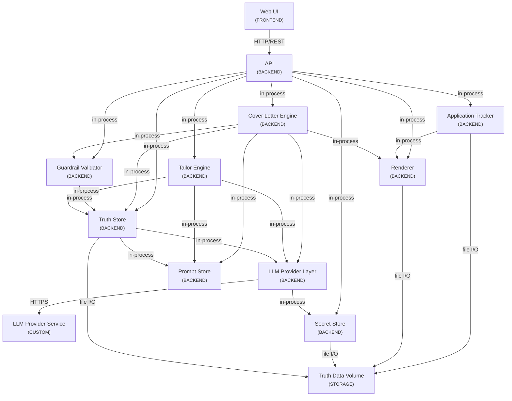

<!-- generated:start file:system-map -->
> These architecture docs are **not verified at the current commit** (no full drift sweep has run yet). Treat them as a snapshot and verify against source before relying on them.

# System Map

## Components

- [API](overview.md) (`api`, backend)
- [Application Tracker](overview.md) (`application-tracker`, backend)
- [Cover Letter Engine](overview.md) (`cover-letter-engine`, backend)
- [Guardrail Validator](overview.md) (`guardrail-validator`, backend)
- [LLM Provider Layer](overview.md) (`llm-provider-layer`, backend)
- [LLM Provider Service](overview.md) (`llm-provider-service`, custom)
- [Prompt Store](overview.md) (`prompt-store`, backend)
- [Renderer](overview.md) (`renderer`, backend)
- [Secret Store](overview.md) (`secret-store`, backend)
- [Tailor Engine](overview.md) (`tailor-engine`, backend)
- [Truth Data Volume](overview.md) (`truth-data-volume`, storage)
- [Truth Store](overview.md) (`truth-store`, backend)
- [Web UI](overview.md) (`web-ui`, frontend)

## Interactions

- [api → application-tracker](interactions/api--application-tracker.md) via `in-process`
- [api → cover-letter-engine](interactions/api--cover-letter-engine.md) via `in-process`
- [api → guardrail-validator](interactions/api--guardrail-validator.md) via `in-process`
- [api → renderer](interactions/api--renderer.md) via `in-process`
- [api → secret-store](interactions/api--secret-store.md) via `in-process`
- [api → tailor-engine](interactions/api--tailor-engine.md) via `in-process`
- [api → truth-store](interactions/api--truth-store.md) via `in-process`
- [application-tracker → renderer](interactions/application-tracker--renderer.md) via `in-process`
- [application-tracker → truth-data-volume](interactions/application-tracker--truth-data-volume.md) via `file I/O`
- [cover-letter-engine → guardrail-validator](interactions/cover-letter-engine--guardrail-validator.md) via `in-process`
- [cover-letter-engine → llm-provider-layer](interactions/cover-letter-engine--llm-provider-layer.md) via `in-process`
- [cover-letter-engine → prompt-store](interactions/cover-letter-engine--prompt-store.md) via `in-process`
- [cover-letter-engine → renderer](interactions/cover-letter-engine--renderer.md) via `in-process`
- [cover-letter-engine → truth-store](interactions/cover-letter-engine--truth-store.md) via `in-process`
- [guardrail-validator → truth-store](interactions/guardrail-validator--truth-store.md) via `in-process`
- [llm-provider-layer → llm-provider-service](interactions/llm-provider-layer--llm-provider-service.md) via `HTTPS`
- [llm-provider-layer → secret-store](interactions/llm-provider-layer--secret-store.md) via `in-process`
- [renderer → truth-data-volume](interactions/renderer--truth-data-volume.md) via `file I/O`
- [secret-store → truth-data-volume](interactions/secret-store--truth-data-volume.md) via `file I/O`
- [tailor-engine → llm-provider-layer](interactions/tailor-engine--llm-provider-layer.md) via `in-process`
- [tailor-engine → prompt-store](interactions/tailor-engine--prompt-store.md) via `in-process`
- [tailor-engine → truth-store](interactions/tailor-engine--truth-store.md) via `in-process`
- [truth-store → llm-provider-layer](interactions/truth-store--llm-provider-layer.md) via `in-process`
- [truth-store → prompt-store](interactions/truth-store--prompt-store.md) via `in-process`
- [truth-store → truth-data-volume](interactions/truth-store--truth-data-volume.md) via `file I/O`
- [web-ui → api](interactions/web-ui--api.md) via `HTTP/REST`

## Groups

- [TruthCV Container (single Docker image)](groups/truthcv-container-single-docker-image.md) (`truthcv-container-single-docker-image`, 12 member(s))
<!-- generated:end file:system-map -->
